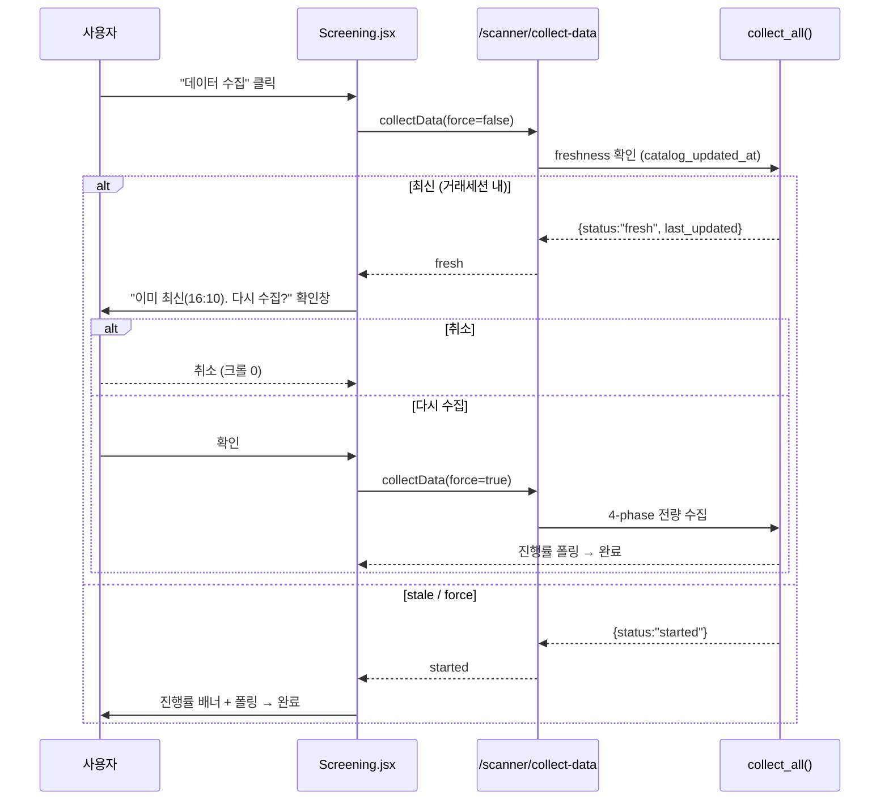

# 데이터 수집 기능 전면 점검 및 개선 계획 (2026-07-20)

> **개정판 (rev.2)** — 이 앱은 **24시간 데몬이 아니라 데스크톱 App**으로 동작하며,
> 데이터는 **앱 실행 중 + 사용자가 수집 버튼을 클릭할 때 온디맨드로 재수집**된다.
> 이 런타임 모델을 전제로 전체 수집 기능을 재분석한다. 각 항목은 `[ ]` 진행 상태로 표시한다.

## 진행 상태 표기
- `[ ]` 미착수 `[x]` 완료 `[skip]` 보류(사유 명시)

---

## 0. 런타임 모델 (핵심 전제)

```
앱 실행(launch)
  └─ startup_event
       ├─ scheduler.start()            → cron 잡 등록만 함 (아래 ★ 참고)
       └─ run_initial_collection()     → 앱 켤 때마다 실행:
            ├─ collect_periodic_data()  = 등록 6종목 가격/매매동향/뉴스 (smart)
            └─ _collect_fundamentals_if_needed()  = 오늘 미수집이면 펀더멘털

사용자 클릭
  ├─ [종목발굴] 수집 버튼 → POST /scanner/collect-data
  │     └─ CatalogDataCollector.collect_all()  ← 무거운 4-phase 전량 재수집
  ├─ [설정] 종목목록 수집 → POST /settings/ticker-catalog/collect
  │     └─ TickerCatalogCollector.collect_all_stocks()  (KOSPI/KOSDAQ/ETF 목록)
  └─ [설정] 전체 수집 → POST /data/collect-all  (등록종목 + 펀더멘털)

앱 종료 → shutdown_event → scheduler.stop()
```

★ **스케줄러(cron)는 사실상 무력화된다.** AsyncIOScheduler는 앱 프로세스 안에서만 살아 있어,
03:00/15:30/16:00/16:30 잡은 **그 시각에 앱이 열려 있어야만** 발화한다. 대화형 데스크톱 사용
패턴(잠깐 열었다 닫음)에서는 거의 발화하지 않는다. 3분 주기 잡만 **세션이 열려 있는 동안** 몇 번 발화한다.

### 이 모델이 바꾸는 것
1. **"백그라운드 사전 수집으로 미리 데워둔다"는 전제가 성립하지 않는다.** 수집 버튼을 누르면
   대부분 **cold 상태**에서 전량 크롤한다.
2. **스캐너(`stock_catalog`) 데이터는 버튼을 누르기 전까지 비어 있거나 오래된 채로 남는다.**
3. 사용자는 클릭 후 **진행률 바를 수 분간 지켜보며 동기적으로 대기**한다 → wall-clock 단축이 목표.
4. rev.1에서 "하루 2회 자동 중복"으로 본 것들은 **자동으로 안 도니 중복이 아니다.** 대신
   **클릭할 때마다 매번 전량 재수집(freshness 가드 없음)** 이 진짜 반복 수집이다.

---

## 1. 수집 기능 인벤토리 (전체)

| # | 수집기 | 대상/소스 | 실제 트리거(비데몬) | 페이지 비용 | 반복/중복 방지 |
|---|--------|----------|--------------------|------------|---------------|
| 1 | `ETFDataCollector` 가격 | 등록종목(6) `sise_day.naver` | **앱 실행 시** + collect-all 버튼 | days당 1~N p | ✅ `_smart`(collection_status) |
| 2 | `ETFDataCollector` 매매동향 | 등록종목 `frgn.naver` | 위와 동일 | days당 1~N p | ✅ `_smart` |
| 3 | `NewsScraper` 뉴스 | 등록종목 검색 API | **앱 실행 시** + 세션 중 3분마다 | API 1회/종목 | ✅ `ON CONFLICT` (단, 재호출은 발생) |
| 4 | `IntradayDataCollector` 분봉 | 등록종목 `sise_time.naver` | 종목상세 진입 시 + **장중 20초 폴링** | full 40p+/증분 ≤10p | ✅ **증분수집 (모범)** — 단, 장중 재수집 임계 180초로 **분단위 요구 미달(R7)** |
| 5 | `TickerCatalogCollector` 종목목록 | KOSPI/KOSDAQ/ETF 목록 | **설정 화면 버튼** | KOSPI 80p+KOSDAQ 110p | ❌ freshness 가드 없음 |
| 6 | `CatalogDataCollector` 스캐너 가격/수급 | 스캐너용 전체 | **종목발굴 수집 버튼** | **매우 큼(아래)** | ❌ **매 클릭 전량 재수집** |
| 7 | 펀더멘털(ETF/STOCK) | 등록종목 네이버 main | 앱 실행 시(오늘 미수집만) + collect-all | 종목당 1~2 p | ✅ 오늘 수집분 스킵 |

### 6번(종목발굴 수집)의 4단계 — 사용자가 실제로 기다리는 작업
- **Phase 1** `_collect_etf_prices`: `etfItemList` JSON 1회. **빠름(~1초)**
- **Phase 2** `_collect_supply_demand`: **ETF 전체(~800개)** 각 `frgn.naver` **최대 15p**(YTD 도달까지). 워커 5, 0.2s 지연. **가장 느림(수 분)**
- **Phase 3** `_save_to_database`: UPSERT
- **Phase 4** `_update_stock_prices`: `sise_market_sum` **KOSPI 80p + KOSDAQ 110p 순차** + 상위 500개 `frgn.naver` 15p씩. **느림(수 분)**

---

## 2. 반복(중복) 수집 — 비데몬 모델 기준 재정의

### R1. 수집 버튼을 누를 때마다 전량 재수집 (freshness 가드 부재) ★최중요·신규
`collect_all()`에는 **"오늘/최근 N시간 내 이미 수집했으면 스킵"** 가드가 없다. 동시 실행만 락으로 막을 뿐(`_catalog_collection_lock`), 몇 분 전에 받은 데이터라도 **버튼을 다시 누르면 Phase 1~4를 처음부터 전량 재크롤**한다. 가격/매매동향의 `_smart`(collection_status 기반 스킵)에 해당하는 장치가 스캐너 수집엔 없다. → 온디맨드 모델에서 **가장 흔한 낭비**.

### R2. YTD 계산용 15페이지 재수집 ★최중요
`_fetch_supply_data`(`catalog_data_collector.py:534`)가 종목마다 15p까지 페이징하는 유일한 이유는 YTD 기준가(올해 첫 거래일 종가) 도달이다(`MAX_SUPPLY_PAGES=15`).
- 실제 필요: 수급 1행(1p), 주간 6행(1p), 월간 20행(2p). **YTD만 딥 페이징 강제.**
- 7월 기준 1월까지 ≈ 13p → 사실상 모든 종목이 15p 상한 소진.
- **YTD 기준가는 연중 불변**인데 `stock_catalog.ytd_base_date`를 저장하고도 매번 무시하고 재크롤. → 최대 **7배** 낭비. 비데몬이라 사용자가 이 비용을 **동기적으로** 매 클릭 부담.

### R3. `sise_market_sum` 크롤이 두 수동 기능에 중복
`sise_market_sum`(KOSPI 80p + KOSDAQ 110p)을 **기능 5(설정 종목목록 수집)** 와 **기능 6 Phase 4** 가 각각 크롤한다. 사용자가 두 버튼을 연이어 누르면 동일 190p를 두 번 크롤. 한쪽이 방금 채운 `stock_catalog`의 가격을 다른 쪽이 freshness 체크 없이 재크롤.
> rev.1의 "하루 2회 자동 중복"에서 **"두 수동 기능 간 중복 + 클릭마다 재크롤"** 로 정정.

### R4. 앱 실행마다 등록종목 재수집
`run_initial_collection`이 **앱 켤 때마다** 등록 6종목 가격/매매동향/뉴스를 수집. `_smart`가 최신이면 스킵하므로 가격/매매동향은 대체로 저렴하나, **뉴스는 매 실행 재호출**(R5)되고 펀더멘털은 오늘 미수집이면 재수집.

### R5. 뉴스 재호출 + 설정 캐시 무효화
- 세션 중 **3분마다** + 앱 실행마다 전 종목 뉴스 API 재호출(`scheduler.py:90`). `ON CONFLICT`로 대부분 버려지지만 API 호출 자체는 발생.
- `collect_and_save_news`가 호출마다 `Config._stock_config_cache=None` 후 `stocks.json` 재로드(`news_scraper.py:406`) — 병렬 5워커에서 파일 반복 읽기.

### R6. `prices` vs `stock_catalog` 이중 가격 (경미)
등록 ETF 가격이 두 테이블에 독립 수집·저장. 정합성 위험 + 소량 크롤 중복.

### R7. 분봉 장중 갱신 주기가 요구사항(분단위) 미달 ★요구사항
**요구사항: 종목상세 페이지를 보는 동안 분봉은 분단위로 업데이트되어야 한다.** 현재 체인:
- 프론트(`ETFDetail.jsx:221~226`): 장중 staleTime 10초·**20초 폴링**, 수집 중 3초 폴링 — 충분히 빠름 ✅
- 백엔드 캐시(`etfs.py:1115`): 장중 TTL 15초 — 폴링(20초)보다 짧아 문제 없음 ✅
- 백엔드 재수집 트리거(`etfs.py:1013`): 마지막 체결이 **180초(3분) 경과했을 때만** 증분 재수집 ❌
  → 병목은 이 임계값 하나. 프론트가 20초마다 물어봐도 백엔드는 3분에 한 번만 새 데이터를 가져오므로 **차트는 최대 ~3분+수집시간 지연**된다. 네이버 `sise_time`은 약 1분 간격 체결을 제공하므로 임계값을 60초로 낮추면 분단위 갱신이 된다.

---

## 3. 속도 병목 (사용자가 대기하는 구간)

| 병목 | 원인 | 비중 |
|------|------|------|
| Phase 2 (ETF 수급) | ETF ~800 × 최대 15p, 워커 5, 0.2s | **최대, 수 분** |
| Phase 4 sise 순차 | KOSPI 80p + KOSDAQ 110p **순차**, rate 0.3s | ~60초 |
| Phase 4 상위500 수급 | 500 × 최대 15p, 워커 10 | 수 분 |
| 매 클릭 재수집(R1) | freshness 가드 없음 | 상시 |

핵심: **YTD 딥 페이징(R2)** 과 **freshness 가드 부재(R1)** 가 온디맨드 대기시간을 지배한다.

---

## 4. 개선 방안 (비데몬 모델 우선순위)

| ID | 개선 | 대상 | 효과 | 난이도 | 리스크 |
|----|------|------|------|--------|--------|
| **S1** | **수집 freshness 가드** — 최근 N시간 내 수집했으면 스킵(또는 "증분만") | R1 | ★★★ | 하 | 낮음 |
| **S2** | **YTD 기준가 DB 캐싱** → 페이징 2p로 제한 | R2 | ★★★ (~7배↓) | 중 | 낮음 |
| **S3** | **스캐너 증분 수집** — 마지막 수집 이후 변한 것만 갱신(가격/일간수급), 주간/월간/YTD는 저장된 base로 재계산 | R1,R2 | ★★★ | 중 | 중 |
| **S4** | `sise` 결과 공유 — 기능 5/6이 `catalog_updated_at` 오늘값이면 sise 재크롤 스킵 | R3 | ★★ | 중 | 낮음 |
| **S5** | Phase 2/4 워커 상향(5→10), 지연 축소 | 속도 | ★★ | 하 | 중(차단 주의) |
| **S6** | 뉴스를 실행/3분 루프에서 분리(세션당 1회 or 30분) | R5 | ★ | 하 | 낮음 |
| **S7** | `stock_config` 무효화 제거(설정 변경 시에만 리로드) | R5 | ★ | 하 | 낮음 |
| **S8** | **스케줄러 정리** — 비데몬에서 발화 안 하는 cron 잡 제거/문서화, 대신 "실행 시 + 버튼" 온디맨드로 일원화 | 구조 | ★★ | 중 | 낮음 |
| **S9** | **분봉 분단위 갱신** — 장중 재수집 임계 180초→60초 (`etfs.py:1013`), 설정값으로 노출 | R7 | ★★★ (요구사항) | 하 | 낮음 |

### S9 상세 (사용자 요구사항·저비용) — 분봉 분단위 갱신
- `app/config.py`에 `INTRADAY_RECOLLECT_THRESHOLD_SECONDS = int(os.getenv("INTRADAY_RECOLLECT_THRESHOLD_SECONDS", "60"))` 추가, `etfs.py:1013`의 하드코딩 `180`을 대체.
- 부하 검토: 등록종목 상세를 보는 동안만 발생하며, 재수집은 **증분(≤10p, 보통 1p)** + 종목별 락(`_intraday_collecting`)으로 중복 방지 → 장중 종목당 분당 1회 소량 크롤 수준. 네이버 부하 위험 낮음.
- 갱신 체감 주기: 백엔드 임계 60초 + 프론트 20초 폴링 → 사용자 화면 기준 **60~80초 내 신규 체결 반영**. (더 좁히려면 임계 55초로 조정 가능하나 60초로 시작해 실측 후 판단.)
- 프론트/캐시(20초 폴링·15초 TTL)는 이미 충분 — **백엔드 임계값 한 곳만 변경.**
- S1의 freshness 가드는 스캐너(일 단위 데이터) 전용이며 **분봉에는 적용하지 않는다**(분봉은 장중 실시간성이 요구사항).

### S1 상세 (최우선·저비용) — freshness 가드 + force 재수집

freshness(신선도) 가드는 **백엔드 판정 → 프론트 안내 → 사용자 확인 시에만 force 재수집** 3단으로 동작한다. 새 버튼은 만들지 않고 기존 "데이터 수집" 버튼 하나로 처리한다.

#### (1) "N시간" 기준값 — 거래 세션 기준 (권장) + 설정값(보조)
스캐너 데이터(종가·등락률·거래량·외국인/기관 순매수·주간/월간/YTD 수익률)는 전부 **일 단위 확정(end-of-day) 데이터**다. 특히 수급은 **장 마감 후 확정**되어 같은 거래일 안에서는 재수집해도 새 값이 없다. 따라서 고정 N시간보다 **거래 세션 기준 가드가 정확**하다.

- **판정 로직 (권장):** "가장 최근 장 마감 시각" 계산 — 평일 15:40 이후면 *오늘 15:40*, 아니면 *직전 거래일 15:40*(주말 건너뜀). `catalog_updated_at >= 그 시각`이면 **최신 거래일 데이터 확보 → 스킵.**
- **장중(09:00~15:30) 쓰로틀:** 가격만 움직이므로 짧은 재수집 허용 간격을 둔다. 이 값만 설정으로 노출:
  - `app/config.py` `Config`에 `SCANNER_COLLECT_TTL_HOURS = int(os.getenv("SCANNER_COLLECT_TTL_HOURS", "6"))` 추가 (기존 `SCRAPING_INTERVAL_MINUTES`/`CACHE_TTL_MINUTES` 패턴 동일). `.env.example`에 항목 추가.
  - 하드코딩 금지 — 사용자가 조정 가능하도록 설정값으로.
- 요약: **로직은 거래 세션 기준, 장중 쓰로틀 값만 `SCANNER_COLLECT_TTL_HOURS`(기본 6h) 설정.**

#### (2) 백엔드 변경 — `catalog_data_collector.py` / `routers/scanner.py`
- `POST /scanner/collect-data`에 `force: bool = Query(False)` 추가.
- `collect_all(force=False)` 진입 직후(락 획득 후) freshness 판정:
  - `SELECT MAX(catalog_updated_at) FROM stock_catalog WHERE catalog_updated_at IS NOT NULL`
  - `stock_catalog(catalog_updated_at)` 인덱스가 **이미 존재**(`database.py:536`)하므로 판정 쿼리 비용은 무시 가능.
  - `force=False`이고 최신이면 **크롤 없이 즉시 반환**:
    ```json
    { "status": "fresh", "skipped": true, "last_updated": "2026-07-20T16:10:00" }
    ```
  - `force=True`이거나 stale이면 기존 4-phase 진행.
- 라우터는 `force` 값을 `background_tasks.add_task(collector.collect_all, force=force)`로 전달. 단, "fresh" 판정은 **백그라운드 진입 전에 동기 확인**하여 프론트가 즉시 응답을 받도록 한다(진행률 배너를 띄우지 않기 위함).

#### (3) API 레이어 — `services/api.js`
```js
// 기존: collectData: () => api.post('/scanner/collect-data', ...)
collectData: (force = false) =>
  api.post('/scanner/collect-data', null, { params: { force }, timeout: FAST_API_TIMEOUT }),
```

#### (4) 프론트 동작 흐름 — `pages/Screening.jsx`
현재 UI 자산(그대로 재사용):
- "데이터 수집" 버튼 (`Screening.jsx:245`, `handleCollectData` → `scannerApi.collectData()`)
- 진행률 배너 + "중지" 버튼 (`Screening.jsx:258~293`, 폴링 `getCollectProgress`)
- `lastUpdated` = 아이템들의 `catalog_updated_at` 최댓값 (`Screening.jsx:215`) — 이미 마지막 수집 시각을 알고 있음
- 토스트 (`useToast`: success/info/error), 상태 `isCollecting`/`progress`/`startingRef`
- 동일 핸들러를 쓰는 `ThemeExplorer.jsx:48`의 "데이터 수집"도 자동 커버

변경 후 `handleCollectData(force = false)` 흐름:
1. 버튼 클릭 → `collectData(false)` 호출.
2. 응답이 `status === 'fresh'`이면 **진행률 배너를 띄우지 않고** 확인창 표시:
   > "이미 최신 데이터입니다 (오늘 16:10 수집). 그래도 다시 수집할까요?"
   - **취소** → 아무 작업 없음(네트워크/크롤 0).
   - **다시 수집** → `handleCollectData(true)` 재호출 → `collectData(true)` → 강제 재수집 시작(기존 진행률 폴링 그대로).
3. 응답이 `status === 'started'`이면 기존대로 `isCollecting=true` + 진행률 폴링.
4. 확인창은 앱 특성상 **경량 인라인 모달** 권장(기존 토스트는 비차단이라 예/아니오에 부적합). 최소 구현이면 `window.confirm`도 가능하나 UX상 모달 권장.

> **force=true가 발생하는 유일한 경로 = "최신입니다" 안내 후 사용자가 '다시 수집'을 확인했을 때.** 상시 노출 버튼이 아니다.

#### (5) 전체 시퀀스


#### (6) 상태별 동작 매트릭스
| 상황 | `catalog_updated_at` | force | 결과 |
|------|---------------------|-------|------|
| 오늘 마감 후 이미 수집 | 최근 세션 이후 | false | **스킵** + "최신입니다" 확인창 |
| 위에서 사용자가 "다시 수집" | — | true | 전량 재수집 |
| 장중, 쓰로틀(6h) 이내 재클릭 | 6h 이내 | false | **스킵** + 확인창 |
| 장중, 쓰로틀 초과 | 6h 초과 | false | 재수집(가격 갱신) |
| 데이터 없음(최초) | NULL | false | 재수집 |
| 수집 진행 중 재클릭 | — | any | `already_running`(기존 락) |

#### (7) 효과
- **불필요한 전량 재크롤을 클릭 한 번으로 회피** — R1 즉시 해소, 백엔드/프론트 최소 변경.
- 확장: 동일 패턴을 설정 화면 "전체 수집"(`/data/collect-all`)·"종목목록 수집"(`/settings/ticker-catalog/collect`)에도 적용 가능(이번 범위 외).

### S2 상세 (raw 속도 최대)
1. `stock_catalog`에 `ytd_base_price REAL` 컬럼 추가(`database.py` 마이그레이션 패턴).
2. `_fetch_supply_data`에 기존 `ytd_base_date`/`ytd_base_price` 전달.
3. 올해 기준가 존재 시 `MAX_SUPPLY_PAGES=2`(수급·주간·월간만). 연도 변경/신규상장/미존재 시에만 15p.
4. Phase 2·Phase 4 둘 다 즉시 단축.

### S3 상세 (근본 해결)
- 분봉의 `incremental_collect_and_save` 모범 패턴을 스캐너에 이식.
- 마지막 수집 이후 1일 경과면 **가격/일간수급만 1p 갱신**, 주간/월간/YTD는 저장된 base로 산술 재계산(이미 Phase 4의 non-top 종목이 `week_base_price` 방식으로 수행 중 — 이를 전 종목·전 지표로 일반화).

### S8 상세 (구조 정합성)
- 현재 등록된 cron 잡(03:00/15:30/16:00/16:30)은 비데몬에서 거의 무의미 → **제거하거나**, 서버 배포(웹) 모드에서만 켜지도록 환경 플래그로 분리.
- 데스크톱 App은 "**앱 실행 시 1회 + 버튼 온디맨드**"로 수집 모델을 명시적으로 일원화(문서/코드 일치).

---

## 5. 실행 계획 (체크리스트)

각 Phase 완료 시 해당 테스트 + `cd frontend && npm run build` 통과 확인 후 커밋한다.

### Phase 0 — S9: 분봉 분단위 갱신 (사용자 요구사항·한 줄 변경) ✅ 완료 (2026-07-20)
- [x] **0-1.** `app/config.py`에 `INTRADAY_RECOLLECT_THRESHOLD_SECONDS`(기본 60) 추가, `.env.example` 갱신
- [x] **0-2.** `routers/etfs.py` `elapsed > 180` → `elapsed > Config.INTRADAY_RECOLLECT_THRESHOLD_SECONDS` (`Config` import 추가)
- [x] **0-3.** 검증: config 로드(60) 확인, etfs 라우터 import OK, `test_api.py` 34 passed (1 실패는 `test_batch_summary_with_data`로 이번 변경과 무관·기존 결함). 장중 실측은 실사용 시 확인

### Phase A — S1: freshness 가드 (최우선·저비용) ✅ 완료 (2026-07-20)
- [x] **A1.** `app/config.py` `Config`에 `SCANNER_COLLECT_TTL_HOURS`(기본 6) 추가, `.env.example`에 항목 추가
- [x] **A2.** `catalog_data_collector.py`에 `check_freshness(now=None)` + `_last_market_close`/`_parse_db_timestamp` 헬퍼 추가 — 장외는 직전 마감(15:40) 확정분 확보 여부, 장중(09:00~15:40)은 `SCANNER_COLLECT_TTL_HOURS` TTL. 판정 소스 `MAX(catalog_updated_at)`(인덱스 있음). `collect_all(force=False)`도 락 획득 후 동일 가드로 `{"status":"fresh",...}` 반환
- [x] **A3.** `routers/scanner.py` `POST /collect-data`: `force: bool = Query(False)` 추가, **백그라운드 진입 전** 동기 `check_freshness()` → fresh면 `{"status":"fresh","skipped":true,"last_updated":...}` 즉시 응답, 아니면 `background_tasks.add_task(collector.collect_all, force=True)`
- [x] **A4.** `frontend/src/services/api.js` `scannerApi.collectData(force = false)` — `params: { force }` 전달
- [x] **A5.** `Screening.jsx` `handleCollectData(force = false)` — `fresh` 응답 시 배너 없이 "이미 최신입니다 (MM/DD HH:MM 수집). 다시 수집할까요?" 확인 모달 → 확인 시 `handleCollectData(true)`. 이벤트가 `force`로 새는 것 방지 위해 버튼/`ThemeExplorer` onClick을 `() => handleCollectData()`로 래핑. 중복 클릭 방지 `requestingRef`
- [x] **A6.** 검증: `tests/test_scanner_freshness.py` 신규(15 케이스: 마감/장중/TTL/NULL + 엔드포인트 fresh/force/stale) — scanner/catalog/freshness 37 passed, scheduler 14 passed, `npm run build` 통과

### Phase B — S2: YTD 기준가 DB 캐싱 (크롤 시간 최대 단축) ✅ 완료 (2026-07-20)
- [x] **B1.** `database.py` 마이그레이션 목록에 `("ytd_base_price", real_type)` 추가
- [x] **B2.** `_load_ytd_base_cache()` 신규 — 올해 `ytd_base_date`인 기준가만 로드. Phase 2(`_collect_supply_demand`)/Phase 4(`fetch_supply`)가 이를 `_fetch_supply_data(cached_ytd_base=...)`로 전달. 유효 캐시면 **페이징 상한 15p → 2p**(1페이지=20행이라 월간까지 충분), YTD는 캐시 기준가로 산술 계산
- [x] **B3.** ETF UPSERT(PG/SQLite) + Phase 4 종목 UPDATE에 `ytd_base_price = COALESCE(...)` 반영. `_load_ytd_base_cache`가 연도 접두사로 필터링하므로 **연말 롤오버 시 작년 캐시는 자동 무효 → 딥 페이징 재확보**
- [x] **B4.** 검증: `test_scanner_ytd_cache.py` 신규(캐시 시 1p 종료 / 무캐시 딥페이징 / 작년캐시 무시). 관련 스위트 52 passed, 스케줄러+배치 27 passed. **라이브 실측(005930): 무캐시 2.02s → 캐시 0.42s (~4.8배↓)**, ytd/weekly/monthly 결과 완전 일치

### Phase B+ — 수집 데이터 활성화 버그 수정 (브라우저 검증 중 발견) ✅ 완료 (2026-07-20)
- **증상**: "데이터 수집" 후에도 스캐너가 빈 목록. 수집은 정상(1,146 ETF 가격/수익률/YTD 채워짐)이나 전부 `is_active=0`.
- **원인**: 스캐너는 `is_active=1`만 표시하는데, `catalog_data_collector`의 ETF UPSERT `ON CONFLICT DO UPDATE`와 Phase 4 종목 UPDATE가 가격만 갱신하고 활성 플래그를 켜지 않음. 기존 행(과거 카탈로그의 `is_active=0`)이 계속 숨겨짐.
- **수정**: 라이브 소스(etfItemList/sise_market_sum)는 상장 종목만 반환하므로, 가격을 수집한 행을 활성화. ETF UPSERT는 `is_active = CASE WHEN close_price IS NOT NULL THEN TRUE/1 ELSE 기존 END`, Phase 4 종목 UPDATE는 `is_active = {TRUE|1}`(dialect별). → "데이터 수집"만으로 스캐너 노출.
- **검증(브라우저)**: 재수집 후 스캐너 ETF 1,146 / KOSPI 1,330 / KOSDAQ 1,821 종목 정상 표시. **S2 실측 재확인: 1차 1,145.8s(YTD 기준가 최초 생성·딥페이징) → 2차 192.5s (~6배↓, 캐시 1,605개 재사용)**.

### Phase C — S3: 스캐너 증분 수집 (B 실측 후 잔여 병목 클 때만)
- [ ] **C1.** 마지막 수집 후 1거래일 이내면 가격/일간수급 1p만 갱신, 주간/월간/YTD는 저장된 base로 산술 재계산 (Phase 4 non-top 종목의 `week_base_price` 방식을 전 종목·전 지표로 일반화)
- [ ] **C2.** 검증: 증분/전량 결과 일치 테스트

### Phase D — 보조 개선 (독립적, 순서 무관) — D2/D3/D5 완료 (2026-07-20)
- [x] **D1.** S4: `sise_market_sum` 크롤 결과 공유 ✅ 완료 (2026-07-20) — 종목목록 수집과 스캐너 Phase4가 동일 `_collect_sise_stocks`를 호출하는 점을 활용해 **프로세스 레벨 TTL 캐시**(`SISE_CACHE_TTL_MINUTES`, 기본 30) 도입. 종목목록 수집은 항상 fresh 크롤(리스트 권위 유지)하되 결과를 캐시에 저장, Phase4는 `use_cache=True`로 재사용→190p 중복 크롤 생략. 취소/에러 부분결과는 캐시 안 함, 재사용 시 격리 복사본 반환. 라이브: 2회차 0.000s(재크롤 0). 테스트 `test_sise_cache.py` 4케이스
- [x] **D2.** S6: 뉴스 쓰로틀 — `NEWS_COLLECT_INTERVAL_MINUTES`(기본 30) 추가. `collect_periodic_data`가 마지막 뉴스 수집 후 간격 이내면 뉴스 단계 스킵(가격/매매동향은 매 주기 유지). 라이브 확인: 최초 실행 "뉴스 68건", 이후 주기 "뉴스 건너뜀(쓰로틀)"
- [x] **D3.** S7: `collect_and_save_news`의 매 호출 `Config._stock_config_cache=None` 제거. 캐시는 settings/stocks_manager의 `reload_stock_config`(설정 변경 시)에서만 무효화 → 병렬 워커 stocks.json 반복 재읽기 제거
- [ ] **D4.** S5: Phase 2/4 워커·지연 튜닝 (미착수 — B 적용으로 종목당 ~1p라 우선순위 낮음, 필요 시 실측 후)
- [x] **D5.** S8: `ENABLE_SCHEDULED_JOBS`(기본 true) 추가. 시각 기반 cron(일일 15:30·백필 일02:00·카탈로그 03:00·카탈로그데이터 16:00·펀더멘털 16:30)을 플래그로 분리 — 웹 배포(데몬)=true 유지, 데스크톱 App(비데몬)=false로 "실행 시+버튼" 온디맨드 일원화. 주기 수집(세션 중)은 항상 유지

---

## 6. 잘 되어 있는 부분 (조치 불필요)
- **분봉 증분수집**(`incremental_collect_and_save`): DB 마지막 시각 이후만 수집 → S3의 참조 모범. (수집 방식은 모범이나 장중 재수집 임계 180초는 요구사항 미달 — R7/S9에서 조치)
- **가격/매매동향 스마트 수집**(`_smart`+`collection_status`): 최신이면 스킵. 스캐너에도 이 사상 확산 필요(S1/S3).
- **뉴스 DB 중복방지**: `ON CONFLICT(ticker,url)`.
- **펀더멘털 오늘-가드**: `_collect_fundamentals_if_needed`가 오늘 수집분 스킵.

---

## 7. 파일 참조
- `backend/app/services/catalog_data_collector.py` — 스캐너 4-phase, `_fetch_supply_data`(YTD 15p), `_update_stock_prices`(Phase4 sise)
- `backend/app/services/ticker_catalog_collector.py` — `_collect_sise_stocks`(80p/110p)
- `backend/app/services/scheduler.py` — `run_initial_collection`(실행 시), cron 잡 등록(비데몬 무력)
- `backend/app/services/intraday_collector.py` — 증분수집 모범 사례
- `backend/app/services/data_collector.py` — `_smart` 수집
- `backend/app/routers/scanner.py` / `routers/data.py` — 수집 트리거 엔드포인트
</content>
